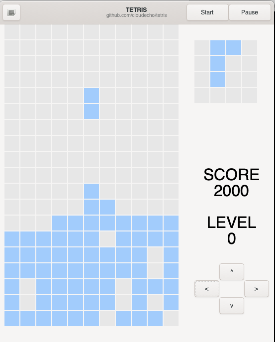

## Introduction

A Tetris game written in Go, GUI drived by gtk3. 

## Build

```sh
go build -o bin/tetris  ./main
```

## Screenshot




## Requirements for macOS

```sh
sudo port install glib2
sudo port install cairo
sudo port install gtk3

sudo port install xorg-server
# Re-login 
echo $DISPLAY
# /private/tmp/com.apple.launchd.dyPCGZeHCc/org.macports:0

```

See https://www.macports.org/install.php#source for MacPorts
